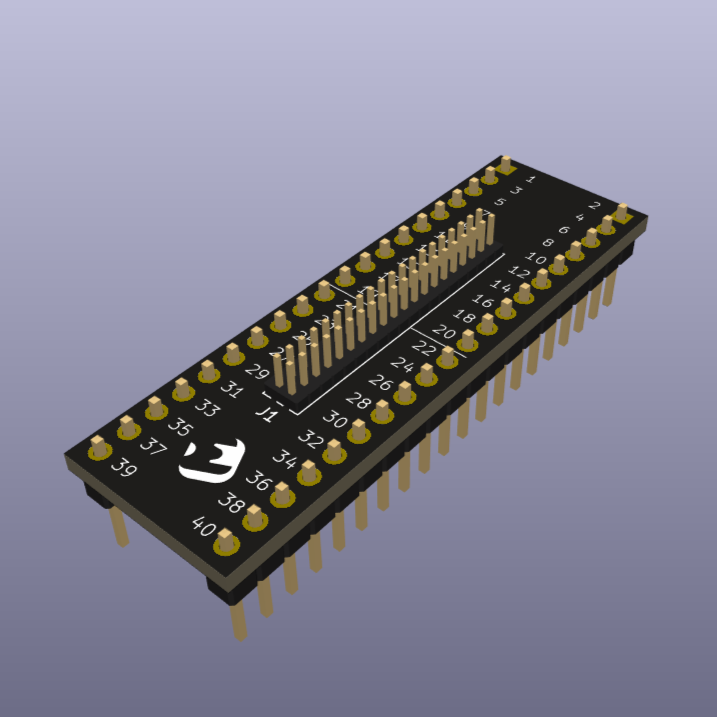

# 1.27 Pitch to 2.54 Pitch Converter Boards

Minimal, open-source, KiCad boards for converting dual-row 1.27 mm connectors to standard 2.54 mm headers.
Useful for prototyping, debugging, or breaking out fine-pitch connectors to breadboard-friendly spacing. Available variants: 40-pin, 20-pin, and 10-pin.

  

  📟 <a href="https://www.pcbway.com/project/shareproject/Dual_row_40_pin_1_27_pitch_to_2_54_pitch_converter_board_1d84e70d.html">PCBWay Project</a>

This project was inspired by a need for quick, reliable adapter boards during embedded systems development (check out the [blog post](https://makeprogress.ee/blog/prototyping-in-an-hour-a-small-pcb)).

## License

This project is released under CERN Open Hardware Licence Version 2 - Permissive.